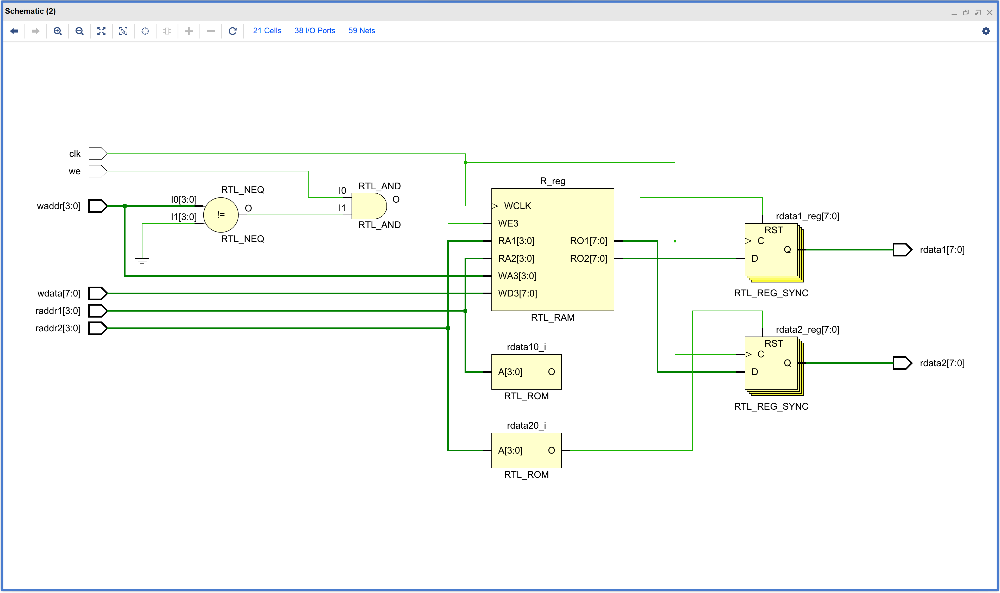
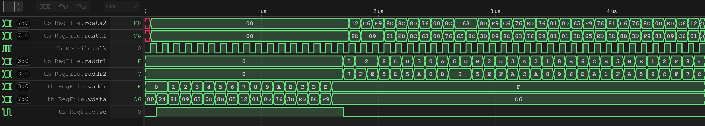
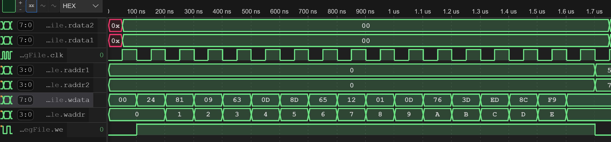
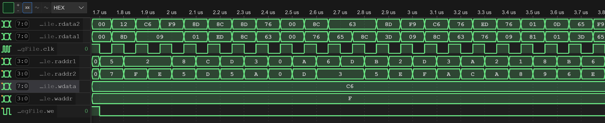

## Midterm Problem 01

In this exercise, you are asked to design a 16x8-bit register file for a 8-bit processor. The register file has two read ports and one write port. The register file is synchronous and the clock frequency is 100MHz. The register file has the following interface:

```verilog
module RegFile(
    input wire [3:0] raddr1,
    input wire [3:0] raddr2,
    input wire [3:0] waddr,
    input wire we,
    input wire clk,
    input wire [7:0] wdata,
    output reg [7:0] rdata1,
    output reg [7:0] rdata2
);
```

*Xilinx Vivado Synthesized Example Design*


*Simulate your design locally.*
```shell
[ex01]$ iverilog simulation.v 
[ex01]$ ./a.out 
VCD info: dumpfile wave.vcd opened for output.
                   0 0 0 0 0 00 xx xx
               50000 0 0 0 0 00 00 00
              100000 0 0 0 1 24 00 00
              200000 0 0 1 1 81 00 00
              300000 0 0 2 1 09 00 00
              400000 0 0 3 1 63 00 00
...
... ommited for brevity
...
             4600000 8 7 f 0 c6 c6 c6
             4650000 8 7 f 0 c6 01 12
             4700000 f c f 0 c6 01 12
             4750000 f c f 0 c6 c6 ed
```

*You can also view the waveform (wave.vcd) using vscode' plugin.*


*Write Data inot Register File*


*Read Data from Register File*


*Run the testing script to validate your solution.*
```shell
[ex01]$ python ../testing.py
Compilation successful.
VCD info: dumpfile wave.vcd opened for output.
                   0 0 0 xx xx xx xx
               50000 0 0 00 00 00 00
             1700000 9 5 00 00 00 00
             1750000 9 5 7b 32 7b 32
             1800000 9 9 7b 32 7b 32
             1850000 9 9 7b 7b 7b 7b
 ...
 ... ommited for brevity
 ...
            11500000 d f 8f 33 8f 33
            11550000 d f 64 a8 64 a8
            11600000 d a 64 a8 64 a8
            11650000 d a 64 f9 64 f9

Test PASSED.
```

