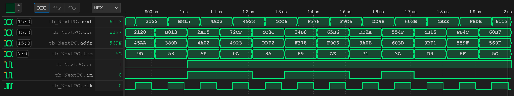

## Exercise 2: Design of a 16-Bit Program Counter Module for the Toy Processor

The goal of this assignment is to design a 16-bit program counter module in Verilog. This module is an essential component for the 16-bit Toy processor that we will be building in the near future. The program counter will be responsible for managing the program flow within this processor.

### Specifications:
You are tasked with developing a Verilog module that fulfills the following specifications:

- Positive Clock Edge Trigger: The program counter should be updated on the positive edge of the clock signal (clk). This ensures that the program counter changes synchronously with the clock.

- Branching Logic: The program counter should be capable of branching under certain conditions. The branching is controlled by the signal br. When br is equal to 0, the program counter should increment by 2.

- Conditional Branching: In addition to unconditional branching, the program counter should support conditional branching based on two conditions: br and im.

    a. When br is equal to 1 and im is equal to 0, the program counter should be incremented by the value of imm. This allows for relative jumps in the program.

    b. When br is equal to 1 and im is equal to 1, the program counter should jump to the address specified in the addr signal. This facilitates absolute addressing within the program.

### Inputs and Outputs:
The Verilog module should have the following inputs and outputs:

- clk (input): The clock signal for synchronous operation.
- br (input): The branch control signal.
- im (input): The immediate condition signal.
- cur (input): The current program counter value.
- addr (input): The address to jump to when br and im are both equal to 1.
- imm (input): The immediate offset value for conditional branching.
- next (output): The updated program counter value to be used in the 16-bit Toy processor.

You are required to implement the Verilog module named NextPC according to the specifications provided. Ensure that your module operates correctly under the defined conditions and synchronously with the clock signal.

Note: This assignment is a crucial step in the development of the 16-bit Toy processor, and your design will play a vital role in its functionality. Good luck with your project!


```verilog
module NextPC (
    input clk,          // Positive clock (clk) edge trigger
    input br,           // Branch condition
    input im,           // Immediate condition
    input [15:0] cur,   // Current program counter
    input [15:0] addr,  // Address to jump to
    input [7:0] imm,    // Offset for the branch
    output [15:0] next  // Output program counter
);
```

*Xilinx Vivado Synthesized Example Design*


*Simulate your design locally.*
```shell
[ex02]$ iverilog simulation.v 
[ex02]$ ./a.out 
VCD info: dumpfile wave.vcd opened for output.
                   0 0 0 0 0000 0000 00 xxxx
               50000 1 0 0 0000 0000 00 0002
              100000 0 0 0 5e81 d609 63 0002
              120000 0 0 1 998d 8465 12 0002
              150000 1 0 1 998d 8465 12 998f
...
... ommited for brevity
...
             1850000 1 1 0 fb4c 559f 8f fbdb
             1900000 0 1 0 fb4c 559f 8f fbdb
             1910000 0 1 0 60b7 569f 5c fbdb
             1950000 1 1 0 60b7 569f 5c 6113
             2000000 0 1 0 60b7 569f 5c 6113
```

*You can also view the waveform (wave.vcd) using vscode' plugin.*



*Run the testing script to validate your solution.*
```shell
[ex02]$ ../testing 
Compilation successful.
VCD info: dumpfile wave.vcd opened for output.
                   0 0 0 0 0000 0000 00 xxxx
               50000 1 0 0 0000 0000 00 0002
              100000 0 0 0 5e81 d609 63 0002
              120000 0 0 1 998d 8465 12 0002
              150000 1 0 1 998d 8465 12 998f
...
... ommited for brevity
...
             9900000 0 1 0 1e25 8332 a2 1ec7
             9910000 0 1 1 b014 c03d 4b 1ec7
             9950000 1 1 1 b014 c03d 4b c03d
            10000000 0 1 1 b014 c03d 4b c03d

Test PASSED.
```

